# MyBlog
一个主要由Django和DjangoRestframework开发的个人博客。
后端集成Elasticsearch, Whoosh等搜索引擎。

个人博客可将API_MODE设置为False

在rest模式下，暂时不提供前端源码，可根据后端文档接口（调试模式下http://localhost:8000/docs查看）去写。
rest模式需要在设置中将 API_MODE 设置为True, 在rest模式下，支持多用户博客。

启用rest模式后，后端认证方式变成 session, token, 以及jwt的认证工作模式，同时社会化登录也变成接口的方式调用。

#### 主要功能：
1. 全文检索
2. 搜索建议
3. 相似文章推荐            
4. 上一篇下一篇文章
5. 富文本, 集成kindeditor
6. Admin后台MarkDown支持, 集成 editor.md
7. 自定义用户认证后端
8. 自定义评论系统（前后端）， 线性评论回复点赞， rest接口， 集成富文本编辑器
9. 博文以及评论点赞，回复邮件通知
10. 缓存计数， 缓存数据库同步
11. 集成celery后端异步邮件发送， 异步缓存同步等耗时操作
12. 社会化集成，支持第三方用户帐号登陆
13. 自定义admin后台
14. 树形无限分类（前后端）
15. 博文后端支持选定格式批量导入，导出。(csv, xls, xlsx, tsv, ods, json, yml, html)
16. 服务出错后，邮件通知
17. 博文爬虫定时抓取， 集成Scrapy， Celery调度。
18. 自定义django-Haystack搜索框架下Elasticsearch后端，支持Elasticsearch中文检索。
19. 支持Whoosh搜索后端

#### 环境需要
1. jdk8           # Elasticsearch需要
2. python3
3. Redis        #根据配置修改其他缓存
4. MySQL        #根据配置修改其他数据库
5. Elasticsearch    #可切换到性能较弱的Whoosh搜索引擎
6. Nginx            #非必要
7. Uwsgi            #非必要
8. Supervisor        #非必要

#### 部署（以Docker为例）
本项目docker镜像地址 https://hub.docker.com/r/renkang/myblog/

###### 拉取镜像
$ docker pull renkang/myblog:base

###### 修改MyBlog配置，把你自己的， 数据库密码， 第三方放密钥等写好后打包镜像
$ docker build -t 镜像名 .

###### 镜像打包好后，修改docker-compose.yml里renkang/myblog:base为你打包好的镜像

###### 进入项目根目录执行以下命令完成部署
$ docker swarm init

$ docker stack deploy -c docker-compose.yml myblog

###### 登陆博客镜像的容器终端，执行数据迁移，和创建对应管理员
$ docker exec -it <容器id> bash

$ python manage.py migrate

$ python manage.py createsuperuser

#### 第三方登陆，只做了Github的，其它可以在设置里自己修改，Oauth回调地址在配置文件里

#### 部分截图
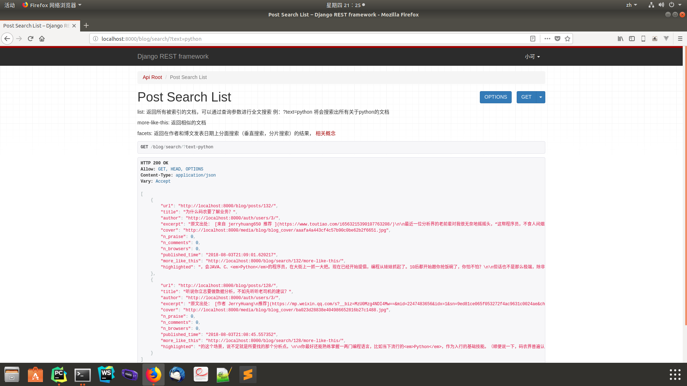
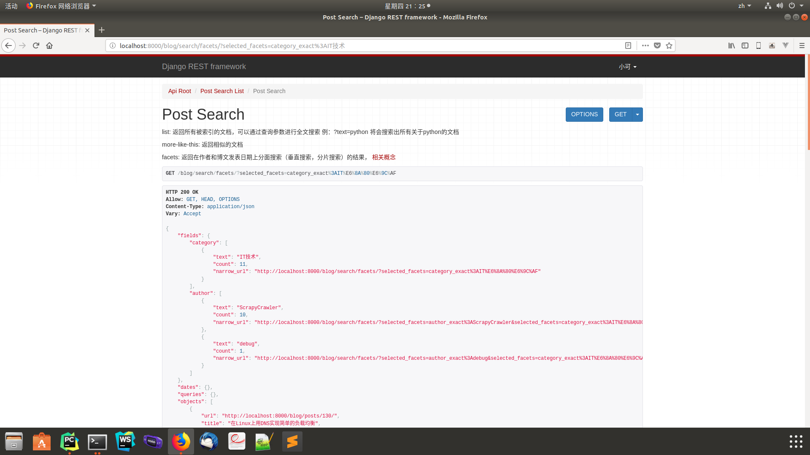

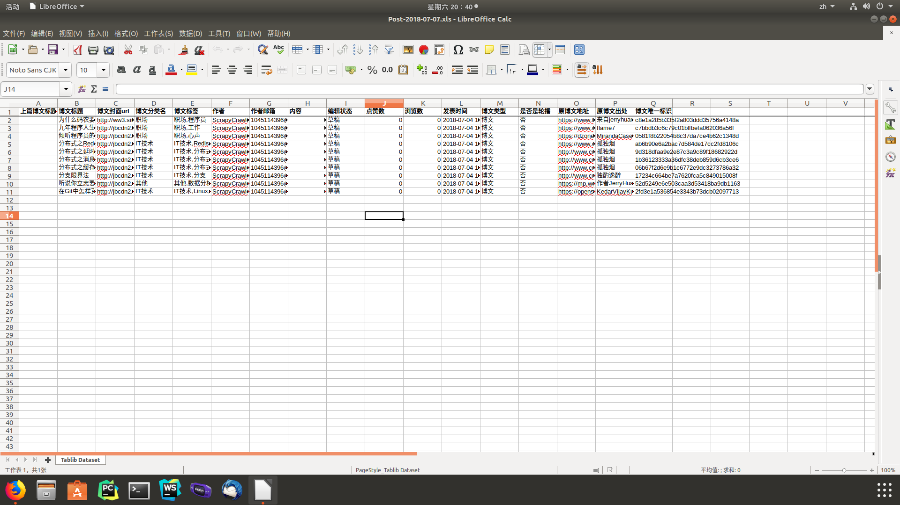
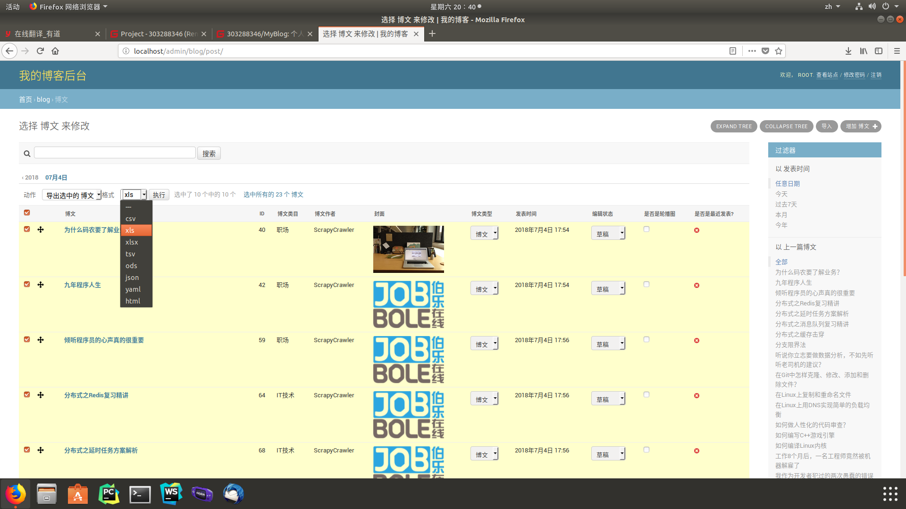
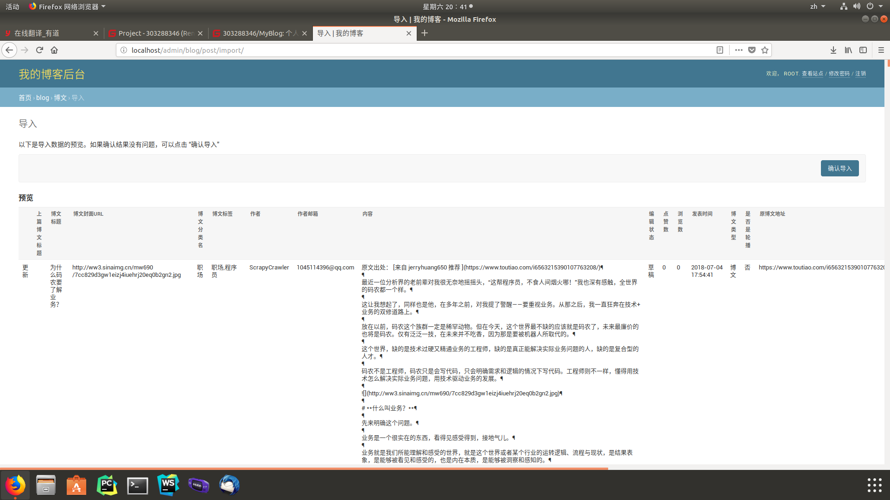
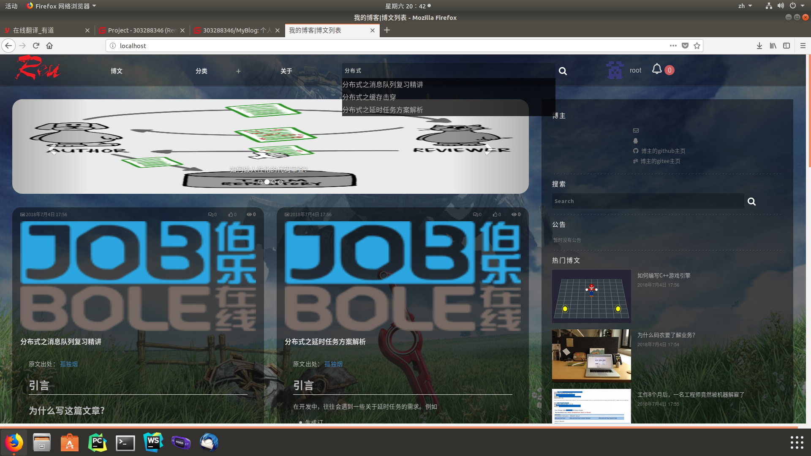
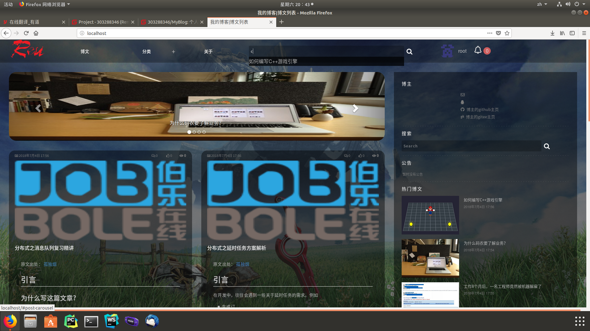
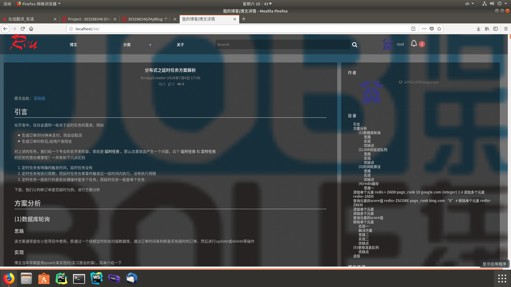
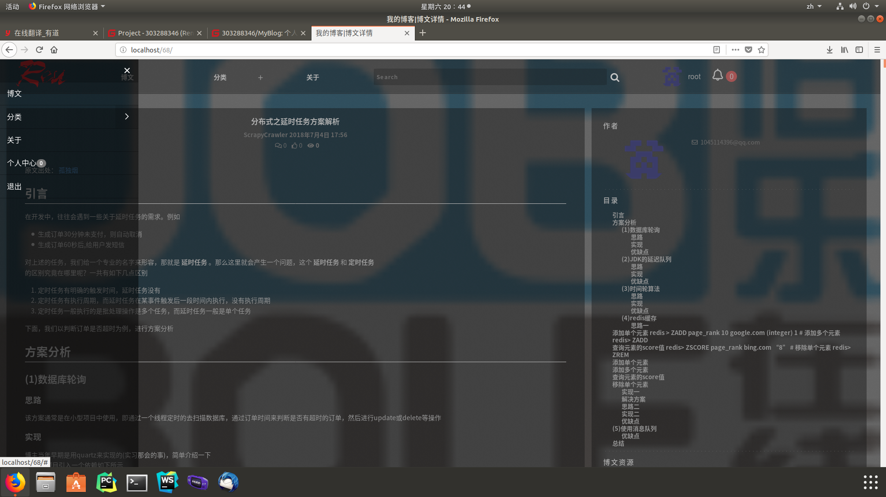
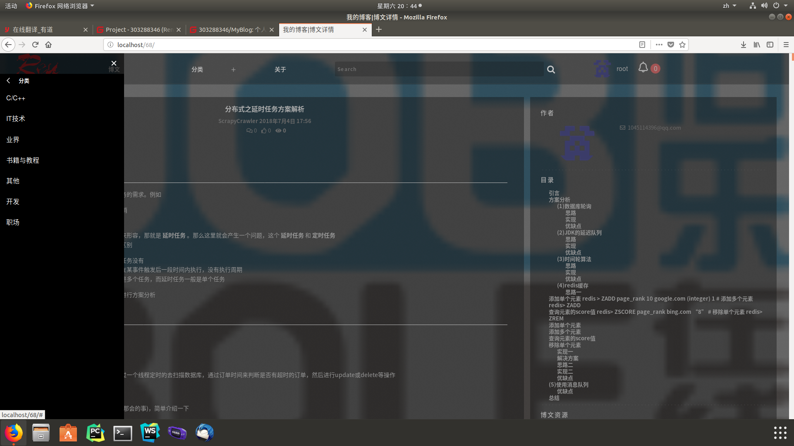
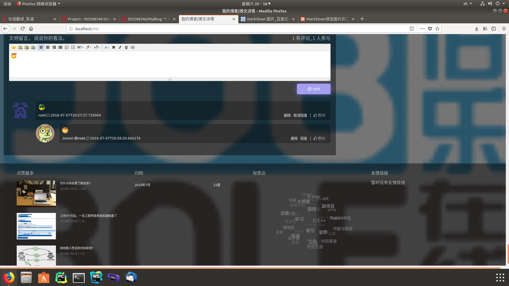

#### 联系我
###### QQ ：303288346
###### Email :rk19931211@hotmail.com